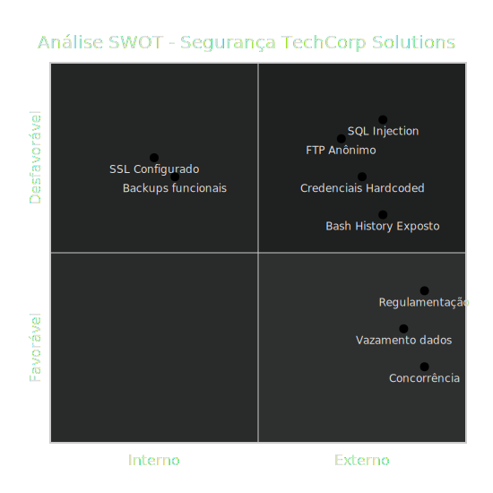

# 04-swot.md

# Análise SWOT - Segurança TechCorp Solutions

## Forças
- Backups funcionais
- SSL configurado
- Serviços essenciais respondendo

## Fraquezas
- FTP anônimo
- SQL Injection crítico
- Credenciais hardcoded
- .bash_history exposto
- Arquivos sensíveis acessíveis via web

